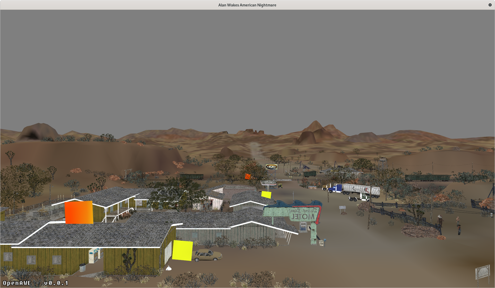

OpenAWE - Open Implementation of the Alan Wake Engine
=====================================================


[](https://gitter.im/OpenAWE-Project/community?utm_source=badge&utm_medium=badge&utm_campaign=pr-badge)

OpenAWE is an open source reimplementation of Remedy Entertainments Alan Wake Engine, in later iterations known, as the 
Northlight Engine. The main goal is to have Alan Wake and its successor Alan Wakes American Nightmare working in a 
portable manner. The secondary goal is to also allow the successor games, Quantum Break and probably even Control
working with the same technical foundation. The code stands under the [GPL-3.0-or-later](https://spdx.org/licenses/GPL-3.0-or-later) License except for the libraries contained
the folder 3rdparty.


Building
--------
Make sure to not include the `$` when running these. It signifies that the commands should be run as your user, not root.
Commands that should be run as root (with sudo) are marked with a `#`.

```bash
$ git clone https://github.com/OpenAWE-Project/OpenAWE.git --recurse-submodules
$ cd OpenAWE
$ mkdir build
$ cd build
```

The development files of the following dependencies need to be installed to build OpenAWE. The way these are acquired
varies depending on your operating system (and in the case of Linux, distribution):

 - ZLIB
 - GLFW
 - GLEW
 - GLM
 - TinyXML2
 - OpenGL
 - OpenAL
 - Bullet
 - FMT
 - Ogg
 - Theora
 - Vorbis
 - GTest (Optional, only for unit tests)
 - spdlog

The following dependencies can either come from your system or you can use them through the git submodules. Assuming
you cloned the repository with `--recurse-submodules` as instructed above you will have these available through git
submodules already:

 - EnTT
 - CLI11

To use these from your system instead of the submodule you can set `USE_SYSTEM_ENTT` and `USE_SYSTEM_CLI11`,
respectively.

In addition to these library dependencies, OpenAWE requires the glslc compiler to be installed for building the 
permutations of the glsl shaders.

Next step is to configure CMake and build. The `cmake` invocation will fail if you don't have all aforementioned
dependencies configured on your system. This can be useful to check if you've installed everything as it tells you
what it didn't find:

```bash
$ cmake ..
$ make
```

Assuming these steps went well, you should now have built OpenAWE.

You can then optionally install OpenAWE like so:

```bash
$ sudo make install
```


Usage
-----
To run OpenAWE, do something like this. Note that you need to replace the path with the actual path to your Alan Wake
installation's data directory, and that only Alan Wake's American Nightmare will work at the moment.

```bash
$ ./awe -p /path/to/the/alan/wake/data/directory
```


Controls
--------
OpenAWE features a free camera that can be controlled with keyboard and mouse. Current mappings stand as follows:
```markdown
# Movement
- [WASD] to move forwards/backwards/left/right
- [RF] to move up/down
- [TG] to increase/decrease movement speed
# Camera
- [←→↑↓] to look left/right/up/down
- [YH] to increase/decrease camera speed
- [Q] to switch between controlling camera with keyboard and mouse
- [Alt] + [L] to show or hide the mouse cursor 
```


Screenshots
-----------

